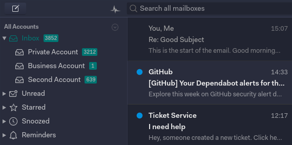

# Mailspring Deep Marine

This Mailspring Theme is a basic dark theme for
the [Mailspring](http://www.getmailspring.com/) email client.



## Installing

Installing this theme in Mailspring is easy! Here's how you can do it.

1. Fork this repo or download the code. 

2. Open Mailspring  and install the theme by going to `Mailspring > Install New Theme...`
   and selecting the directory.


## Structure

```
.
├── styles                 # All stylesheets
|   ├── index.less         # Main LESS file to import your stylesheets
│   └── ui-variables.less  # UI variables that override N1's defaults
├── package.json           # Metadata about the theme
├── LICENSE.md             # License with usage rights
└── README.md              # Info about this theme and how to use it
```

## Credit
Readability bugs solved thanks to [this repo](https://github.com/asparc/predawn).
